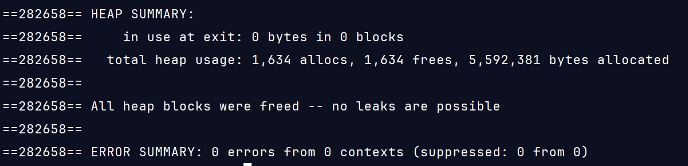

## Debugger and Valgrind Report

### 1. Basic information
 - Team #: 8
 - Github Repo Link: https://github.com/antjmart/cs122c-winter25-antjmart
 - Student 1 UCI NetID: ajmarti8
 - Student 1 Name: Anthony Martinez
 - Student 2 UCI NetID (if applicable):
 - Student 2 Name (if applicable):

### 2. Using a Debugger
- Describe how you use a debugger (gdb, or lldb, or CLion debugger) to debug your code and show screenshots. 
For example, using breakpoints, step in/step out/step over, evaluate expressions, etc. 

I used a mix of gdb sequential steps and some standard print statements in more obscure parts of my code.
I tended to place these before sets of statements, right before loops, in the middle of loops,
and at the end of functions. This allowed me to figure out where my functions were returning
bad error codes. Mainly, the GTests were used to fully determine
if my functionality for things were correct.

### 3. Using Valgrind
- Describe how you use Valgrind to detect memory leaks and other problems in your code and show screenshot of the Valgrind report.
- 

Clean memory usage for all the pfm tests. This helped ensure I was using malloc correctly then
running free when needed.

More memory loss occurred with RBFM tests due to incorrect implementations.